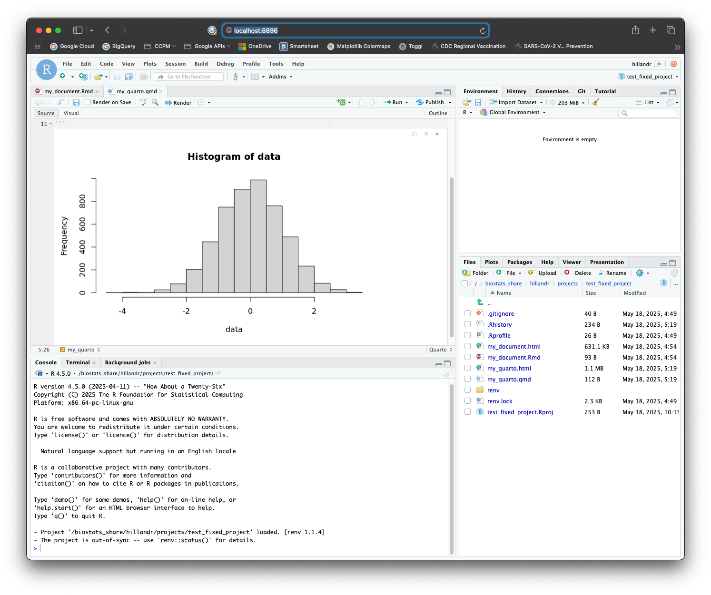

```{r setup, include=FALSE}
knitr::opts_chunk$set(echo = TRUE)
```

## A. Introduction

This document will guide you through running interactive RStudio (and/or JupyterLab) sessions on the Biostats cluster.

Once configured, you'll be able to easily submit RStudio/JupyterLab SLURM jobs, and access them through your browser. 

We'll cover:

1. [First-time Setup](#first-time-setup) - Some configuration steps on your local machine.
2. [Launching RStudio Sessions](#launching-an-rstudio-session) - How to launch an RStudio session on the cluster and connect from your browser.
3. [Launching JupyterLab Sessions](#launching-a-jupyterlab-session) - How to launch a JupyterLab session on the cluster and connect from your browser.
4. [Quitting RStudio/JupyterLab Sessions](#quit-the-rstudiojupyterlab-session) - How to quit an RStudio/JupterLab session.
6. [(Optional) Additional Options](#optional-additional-options-and-job-customization) - Some additional options and information which may be useful.

If you previously followed this guide to set up RStudio/JupyterLab and just need a refresher on how to launch an RStudio/JupyterLab job, check out the [Quickstart](#quickstart-for-returning-users) section.


### A1. Motivation
Using RStudio/JupyterLab on the `csphbiostats` cluster allows you to:

- Use the cluster's significant [computational resources](https://cida-csph.github.io/CIDAtools/articles/CIDA_BIOS_Cluster.html#csph-biostats-hpc-cluster) to work with larger datasets than would be possible on a local machine, while coding interactively in a familiar environment.
- Offload time consuming analysis tasks from your local computer to the cluster (your RStudio/JupyterLab job will keep running on the cluster, even if you log out!)
- Running RMarkdown/Quarto/Jupyter Notebooks and generating reports directly from the cluster.
- Generate and view visualizations in real-time.

### A2. Capabilities

The RStudio container runs R 4.5.0, and supports the usual RStudio functions including RMarkdown/Quartio notebooks, interactive plotting, etc. For convenience, the RStudio container has a variety of commonly used packages pre-installed, including the `tidyverse` family, and also packages many system libraries needed for compiling R packages from source.

The JupyterLab container supports running Jupyter Notebooks (`.ipynb`), and supports all JupyterLab functions. By default, the JupyterLab container has the following kernels installed:

- Python 3.13
- R 4.5.0
- Julia 1.11.5


## B. Questions, Comments, Issues

This project is [hosted on GitHub here](https://github.com/CIDA-CSPH/Biostats-Cluster-Tools). If you have questions, encounter difficulties, or have suggestions for improvements, feel free to either [open an issue on GitHub](https://github.com/CIDA-CSPH/Biostats-Cluster-Tools/issues) or <a href="mailto:andrew.2.hill@cuanschutz.edu">email me directly</a>.

## 1. First-time Setup

Although the RStudio/JupyterLab instance will run on an HPC compute node, you'll log in to the cluster normally (via SSH), and access then RStudio/JupyterLab interface through your local browser.

In order for this to work correctly, we need to configure a few SSH options when logging in to the cluster. These SSH options should only need to be configured once on your local computer (but if you switch to a different computer, you'll need to re-do these SSH configuration steps on that computer as well).

### 1A. Locate SSH Config File

Although you can pass configuration parameters when calling `ssh` on the command line, the simplest way to configure SSH connections is to use the SSH `config` file. The SSH config file is useful because it allows us to define persistent options which will be used each time we log in to the cluster (rather than having to remember which parameters to pass on the command line each time).


On Mac/Unix-like systems, this is located at `~/.ssh/config`, and on Windows this is located at `C:/Users/<username>/.ssh/config`.

If you don't see a file named `config` in that location, that's OK, just create it with your text editor of choice.

**Note:** Some GUI clients (like PuTTY on Windows) do not support port forwarding to Unix sockets (requried functionality to use RStudio/JupyterLab on the cluster). However, modern command-line versions of SSH on Mac and Windows do support this.

### 1B. Add SSH Configuration options

Open up the `config` file in your text editor of choice. If you had a pre-existing `config` file, check if you have an entry with `Host csphbiostats.ucdenver.pvt` or `HostName csphbiostats.ucdenver.pvt`. If you already have an entry, modify it instead of creating a new entry. 

Configure your entry to look something like the below entry, remembering to replace the three `<your_username>` placeholders
with your username on the cluster (whatever username you use to log in through SSH).

```
Host biostats
	HostName csphbiostats.ucdenver.pvt
	User <your_username>
	Port 22
	LocalForward 8895 /tmp/jupyter-<your_username>.sock
	LocalForward 8896 /tmp/rstudio-<your_username>.sock
```

As a quick breakdown of the options:

The `Host <friendly_name>` gives a friendly name to this configuration, which you can use when connecting through SSH, like:

```{bash, eval=FALSE, echo=TRUE}
ssh <friendly_name>
```

The `User` field should be your cluster username, and `Port` can be set to `22`.

The two key elements are the `LocalForward` fields.

```
	LocalForward 8895 /tmp/jupyter-<your_username>.sock
	LocalForward 8896 /tmp/rstudio-<your_username>.sock
```

These options tell the SSH client to forward local traffic on these ports to specific Unix socket paths on the cluster, allowing you to access the running RStudio/JupyterLab jobs.

In this case, port `8895` will be used for JupyterLab and port `8896` will be used for RStudio, but feel free to customize these to any non-reserved ports you like (most ports in the 8100-8999 range should be available).

A fully configured SSH entry looks like:

```
Host biostats
	HostName csphbiostats.ucdenver.pvt
	User hillandr
	Port 22
	LocalForward 8895 /tmp/jupyter-hillandr.sock
	LocalForward 8896 /tmp/rstudio-hillandr.sock
```

Once configured, save and close the file.

### 1C. Test the SSH Connection

Now, we'll run a quick check to verify that the SSH configuration is working as expected. 

First, we need to open a terminal window, which varies slightly by platform:

| OS  | Command |
|-----|------|
| Windows | Search for 'Powershell' or 'Command Prompt' |
| Mac | Search for 'Terminal' |

Once the terminal window is open, type:

```{bash, eval=FALSE, echo=TRUE}
ssh <friendly_name>
```

where `<friendly_name>` is the name you entered in the `Host` field of your SSH config file.

```{r, echo=FALSE, out.width="80%", fig.align="center"}

```


Once you've logged in via SSH, open a web browser on your local machine (but keep the SSH window open!) and enter

```
localhost:8895
```

in the address bar. If you assigned different ports in your config file, modify the address accordingly. 

In the browser, you should see an error screen. This is expected. 

```{r, echo=FALSE, out.width="80%", fig.align="center"}
knitr::include_graphics("localhost_test.png")
```

Moving back to your SSH window, you should see some error messages populate the screen:

```{r, echo=FALSE, out.width="80%", fig.align="center"}

```

If you see these error messages in your SSH window, Congratulations! This means you've sucessfully configured SSH to forward connections on `localhost:8895` and `localhost:8896`. The error messages appear because the browser is attempting to connect, but there is nothing on the other end (yet) to accept the connection.

These error messages will continue to appear in your SSH window as long as you keep the `localhost:8895` browser tab open. Feel free to close the tab now and type `clear` in your SSH window to clear the messages from your terminal screen.


#### 1C.1 Troubleshooting

If you don't see the error messages in your SSH window:

1. Make sure the `localhost:<port>` you're visiting in browser matches one of the `LocalForward <port>` lines in your SSH config file. 
2. Check that you're logging in with the `ssh <friendly_name>` from your SSH config file.
3. Verify that these ports aren't being used by something else on your machine (i.e. a local Jupyter Notebook).


### 1D. Get Launch scripts

To launch an RStudio/JupyterLab session, you'll need a copy of the `rstudio_helper.sh` and `jupyter_helper.sh` scripts. These scripts help automate some of the setup for RStudio/JupyterLab sessions.

In your SSH window, navigate to your home directory (`cd ~`) and run:

```{bash, eval=FALSE, echo=TRUE}
cp /biostats_share/hillandr/containers/scripts/rstudio_helper.sh .
cp /biostats_share/hillandr/containers/scripts/jupyter_helper.sh .
```

To make copies of both scripts in your home directory (`~`).

## 2. Launching an RStudio Session

Once you have copies of the launch scripts, in your SSH window try running:

```{bash, eval=FALSE, echo=TRUE}
./rstudio_helper.sh
```

You should see a message `Submitted batch job <job_id>`. This is the Job ID for your RStudio job, which you'll need again when you want to shut down the RStudio session. This ID will change each time you launch a new job.

Now, run `squeue`. 

You should see an entry for your Job ID, similar to my example below.

```{r, echo=FALSE, out.width="80%", fig.align="center"}
knitr::include_graphics("biostats_hpc_rstudio_launch.png")
```

This job will also produce two output files `rstudio_helper.out` and `rstudio_helper.err` which will log outputs or errors that the system encounters. 

If you *don't* see your Job ID in the `squeue` list, try inspecting the two above files for any error messages.

### 2A. Connect to RStudio

If you can see your RStudio job running in `squeue`, go back to your web browser and visit

```
localhost:8896
```

in the address bar. 

You should see a loading screen, and eventually the RStudio interface!

```{r, echo=FALSE, out.width="80%", fig.align="center"}

```

Congratulations! You can now use RStudio on the cluster!

Feel free to try out the interface and verify that everything works as expected. 

When you're finished, shut down the RStudio job by following the instructions in [Quit the RStudio/JupyterLab Job](#quit-the-rstudiojupyterlab-session)

#### 2A.1 Troubleshooting

If you *don't* see the RStudio interface in your browser:

1. Verify that you used the correct port in the browser. (If you used the default config, RStudio is `8896`).
2. Run `squeue` again and verify that your job is still running. If the job is not running, check `rstudio_helper.err` and `rstudio_helper.out` for more information. 


### 2B. Customizing the RStudio Job

The `rstudio_helper.sh` script essentially just automates some cleanup tasks and submits a new `sbatch` batch script which launches RStudio.

If you open `rstudio_helper.sh` and scroll down to the `sbatch <<==SBATCH=SCRIPT==` section, you can customize the parameters of the underlying SLURM job to suit your needs:

```{bash, eval=FALSE, echo=TRUE}
# This command redirects the rest of this script to a sbatch call.
sbatch <<==SBATCH=SCRIPT==
#!/bin/bash
#SBATCH --job-name=rstudio_helper
#SBATCH --output=rstudio_helper.out
#SBATCH --error=rstudio_helper.err
#SBATCH --exclude=csphbiostats.ucdenver.pvt
#SBATCH --mem=64G
#SBATCH --ntasks=1
#SBATCH --cpus-per-task=8

# Launch the container.
apptainer run \
    --no-mount /etc/localtime \
    --bind /biostats_share:/biostats_share \
/biostats_share/hillandr/containers/rstudio.sif

==SBATCH=SCRIPT==

```

The default `rstudio_helper.sh` script submits a job which:

- Runs on any node *except* the head node `--exclude=csphbiostats.ucdenver.pvt`
- Requests 8 CPU Cores `--cpus-per-task=8`
- Requests 64GB of RAM `--mem=64G`

You can change any of these values to meet your needs. 

The available resources of each compute node are listed in the article [Computing on the CSPH Biostats Cluster](https://cida-csph.github.io/CIDAtools/articles/CIDA_BIOS_Cluster.html#csph-biostats-hpc-cluster).

## 3. Launching a JupyterLab Session
Once you have copies of the launch scripts, try running:

```{bash, eval=FALSE, echo=TRUE}
./jupyter_helper.sh
```

You should see a message `Submitted batch job <job_id>`. This is the Job ID for your JupyterLab job, which you'll need again when you want to shut down the JupyterLab session. This ID will change each time you launch a new job.

Now, run `squeue`. 

You should see an entry for your Job ID, similar to my example below.

```{r, echo=FALSE, out.width="80%", fig.align="center"}
knitr::include_graphics("biostats_hpc_jupyter_launch.png")
```

This job will also produce two output files `jupyter_helper.out` and `jupyter_helper.err` which will log outputs or errors that the system encounters. 

If you *don't* see your Job ID in the `squeue` list, try inspecting the two above files for any error messages.

**IMPORTANT:** The first time you launch JupyterLab, it will create a Python `virtualenv` under `~/jupyterlab_env`. This process takes time (in my experience a few minutes). If you are unable to connect to your JupyterLab instance immediately after launching the job, don't worry! The setup process will log output to the output and error logs listed above.

### 3A. Connect to JupyterLab

If you can see your JupyterLab job running in `squeue`, go back to your web browser and visit 

```
localhost:8895
```

in the address bar. 

You should see a loading screen, and eventually the JupyterLab interface!

```{r, echo=FALSE, out.width="80%", fig.align="center"}
knitr::include_graphics("biostats_hpc_jupyter_interface.png")
```

Congratulations! You can now use JupyterLab on the cluster!

Feel free to try out the interface and verify that everything works as expected. 

When you're finished, shut down the JupyterLab job by following the instructions in [Quit the RStudio/JupyterLab Job](#quit-the-rstudiojupyterlab-session)

#### 3A.1 Troubleshooting

If you *don't* see the JupyterLab interface in your browser:

1. Verify that you used the correct port in the browser. (If you used the default config, JupyterLab is `8895`).
2. Run `squeue` again and verify that your job is still running. 
3. If you're launching JupyterLab for the first time, it can take a few minutes for the script to initialize the `/jupyterlab_venv` virtual environment. If the job is running (via `squeue`) but you can't connect through your browser, try waiting ~5-10 minutes for environment to initialize. Subsequent launches of JupyterLab should launch almost instantly.

### 3B. Customizing the JupyterLab Job

The `jupyter_helper.sh` script essentially just automates some cleanup tasks and submits a new `sbatch` batch script which launches JupyterLab.

If you open `jupyter_helper.sh` and scroll down to the `sbatch <<==SBATCH=SCRIPT==` section, you can customize the parameters of the underlying SLURM job to suit your needs:

```{bash, eval=FALSE, echo=TRUE}
sbatch <<==SBATCH=SCRIPT==
#!/bin/bash
#SBATCH --job-name=jupyter_helper
#SBATCH --output=jupyter_helper.out
#SBATCH --error=jupyter_helper.err
#SBATCH --exclude=csphbiostats.ucdenver.pvt
#SBATCH --mem=64G
#SBATCH --ntasks=1
#SBATCH --cpus-per-task=8

# Launch the container.
apptainer run \
    --bind /biostats_share:/biostats_share \
/biostats_share/hillandr/containers/jupyterlab.sif \
    --notebook-dir "$HOME"
==SBATCH=SCRIPT==
```

The default `jupyter_helper.sh` script submits a job which:

- Runs on any node *except* the head node `--exclude=csphbiostats.ucdenver.pvt`
- Requests 8 CPU Cores `--cpus-per-task=8`
- Requests 64GB of RAM `--mem=64G`

You can change any of these values to meet your needs. 

The available resources of each compute node are listed in the article [Computing on the CSPH Biostats Cluster](https://cida-csph.github.io/CIDAtools/articles/CIDA_BIOS_Cluster.html#csph-biostats-hpc-cluster).

## 4. Quit the RStudio/JupyterLab Session
When you're finished using JupyterLab or RStudio, run:

```
scancel <job_id>
```

from your SSH window to kill the job (make sure everything is saved!).

A few things to note:

1. Like other `sbatch` jobs, the RStudio/JupyterLab jobs will continue to run after you log out of your SSH connection (you can try this yourself!). 
    - This means you can log out (via SSH), then log back in later and keep using the same session. 
    - Although you *can* leave RStudio/JupyterLab running, its best to quit the session (using `scancel`) when you're finished to free up resources for other users.
2. **IMPORTANT: Check for a running RStudio/JupyterLab jobs (using `squeue`) before submitting a new one with `./rstudio_helper.sh` or `./jupyter_helper.sh`!!!** 
    - Submitting a second job will not work, and will likely break your original session as well.
    - By running `squeue` you can quickly locate the Job ID of your running `rstudio_helper` or `jupyter_helper` Job (if one is running). You can then either cancel this job with `scancel` or just connect through your browser and keep working.

## 5. Quickstart (for returning users)

The complete process for launching a RStudio/JupyterLab instance (once the [first-time setup](#first-time-setup) is complete) looks like:

1. SSH into `csphbiostats.ucdenver.pvt` 
	- Remember to use your SSH 'friendly name' alias if you configured one.
2. Check for a currently running RStudio/JupyterLab session using `squeue`.
	- To re-use an existing session, skip to step 5.
	- To cancel the existing session, use `scancel <job_id>`.
3. If no existing session is running, from your SSH terminal run either `./jupyterlab_helper.sh` or `./rstudio_helper.sh`.
	- The script should exit after printing a Job ID for your new session.
4. Verify that your new session is running using `squeue` and look for the Job ID.
5. Open your browser to `localhost:8895` (JupyterLab) or `localhost:8896` (RStudio).
6. Done!

## 6. Conclusion

At this point, you should be able to launch, connect to, and cancel RStudio and JupyterLab jobs on the cluster!

The sections below provide some additional configuration options and information, but these sections are completely optional.

## 7. (Optional) Additional Options and Job Customization

This section provides some additional information and configuration options.


### 7A. Apptainer Containers

The JupyterLab and RStudio instances both run inside of Apptainer containers. 

Apptainer (formerly Singularity) containers are stored as self-contained files with the `.sif` extension.

The benefit of hosting JupyterLab and RStudio within containers is that they offer a consistent environment where all dependencies are installed by default. 

The RStudio and JupyterLab containers are derived from a [base container image](https://github.com/CIDA-CSPH/Biostats-Cluster-Tools/blob/main/containers/RBase/docker/Dockerfile) which holds installation of R, Python, and Julia languages, along with packages/libraries to support installing most other common R/Python libraries.

#### 7A.1 Bind Mounts
One important concept when working with containers is a 'bind mount'. Containers are like small Linux installations which run in a separate, read-only filesystem. This means we cannot access any files *outside* of the container by default.

*Bind mounts* allow us to overlay specific parts of the host's filesystem onto the container, so we can read from and write our own files (on the host system) from inside the container. 

By default, Apptainer sets up bind mounts for a few directories including your home directory (`~`), your working directory (`.`) and `/tmp`.

The `jupyter_helper.sh` and `rstudio_helper.sh` scripts also include an additional bind mount:

`--bind /biostats_share:/biostats_share`

which allows us to access the `/biostats_share` directory from inside the container.

If you find yourself unable to access files from within the container, you can add the specific directory as a bind mount by modifying the `*_helper.sh` script to include additional bind mounts:

```{bash, eval=FALSE, echo=TRUE}
# This command redirects the rest of this script to a sbatch call.
sbatch <<==SBATCH=SCRIPT==
#!/bin/bash
#SBATCH --job-name=jupyter_helper
#SBATCH --output=jupyter_helper.out
#SBATCH --error=jupyter_helper.err
#SBATCH --exclude=csphbiostats.ucdenver.pvt
#SBATCH --mem=64G
#SBATCH --ntasks=1
#SBATCH --cpus-per-task=8

# Launch the container.
apptainer run \
    --bind /biostats_share:/biostats_share \
    --bind /another_special_directory:/another_special_directory \
/biostats_share/hillandr/containers/jupyterlab.sif \
    --notebook-dir "$HOME" \
    --venv "$HOME/my_custom_venv"
==SBATCH=SCRIPT==
```

The line `--bind /another_special_directory:/another_special_directory` make the `/another_special_directory` path available in the container (make sure to use an absolute path).

In general, bind mount arguments look like:

`--bind <local_directory>:<container_path>`

To mount `<local_directory>` path on the cluster to `<container_path` inside the container. 

To reduce confusion, I usually mount each local path to the same path within the container (as I did with `/biostats_share`).

### 7B. JupyterLab Options

The JupyterLab container holds an installation of Python 3.13. 

When launched for the first time, the container will create a new `virtualenv` environment in your home directory at `~/jupyterlab_venv`, which will hold all Python dependencies (including JupyterLab itself).

#### 7B.1 Using an alternative `venv` for JupyterLab
Although the `~/jupyterlab_venv` is used by default, you can specify a different virtualenv if you wish.

You can do this by modifying the `jupyter_helper.sh` script and passing a value for the `--venv` parameter to the `jupyter.sif` container.

The would look like:

```{bash, eval=FALSE, echo=TRUE}
# This command redirects the rest of this script to a sbatch call.
sbatch <<==SBATCH=SCRIPT==
#!/bin/bash
#SBATCH --job-name=jupyter_helper
#SBATCH --output=jupyter_helper.out
#SBATCH --error=jupyter_helper.err
#SBATCH --exclude=csphbiostats.ucdenver.pvt
#SBATCH --mem=64G
#SBATCH --ntasks=1
#SBATCH --cpus-per-task=8

# Launch the container.
apptainer run \
    --bind /biostats_share:/biostats_share \
/biostats_share/hillandr/containers/jupyterlab.sif \
    --notebook-dir "$HOME" \
    --venv "$HOME/my_custom_venv"
==SBATCH=SCRIPT==
```

The second-to-last line `--venv "$HOME/my_custom_venv"` sets the path to the alternative venv.

If this path exists already, the launch script will attempt to activate and use this virtual environment. 

If the path does *not* exist, it will be created and initialized with a default set of packages, which includes JupyterLab.

**NOTE:** If you do attempt to use an pre-existing virtual environment, ensure that JupyterLab is installed *before* running `jupyter_helper.sh`, as this script will fail if no JupyterLab installation is found.

#### 7B.2 Setting an Alternative home
By default, the JupyterLab interface will use your `$HOME` (`~`) directory as the launch directory. 

If you wish to use a different directory, you can change the `--notebook-dir` argument in `jupyter_helper.sh` 

### 7C. RStudio Options

The RStudio container uses an installation of R 4.5.0, which is the latest version at the time of writing. 

By default, the container comes with many libraries pre-installed, including the `tidyverse` family of packages.

Additionally, the container has many development libraries installed, which should allow you to compile most R packages from source if required.

#### 7C.1 Renv Usage
Although the container has many libraries pre-installed, I highly recommend using `renv` in each of your RStudio projects. 

You can run `renv::init()` from an RStudio project to initialize `renv`.

#### 7C.2 Changing the R Version

By default, the container uses R-4.5.0, but R-4.4.3 is also installed for compatibility. 

To change the version of R used when launching RStudio, you can change the `R_PATH` variable defined in the `rstudio_helper.sh` script:

```{bash, eval=FALSE, echo=TRUE}
# Default version of R is 4.5.0.
#R_PATH="/opt/R/4.5.0/bin/R"
R_PATH="/opt/R/4.4.3/bin/R"
```

Changing this variable changes the path passed to the `--r-path` argument later in the script.

Note that these paths are relative to the container, not to the cluster's filesystem. 

Currently the only two supported paths (and versions of R) are:

|Version|Path|
|-------|----|
| **R-4.5.0 (default)** | /opt/R/4.5.0/bin/R |
| R-4.4.3 | /opt/R/4.4.3/bin/R |

If you need an alternative version of R installed, open an issue in the [GitHub repository for this project](https://github.com/CIDA-CSPH/Biostats-Cluster-Tools/issues) and I can add it to the container. 

### 7D. Implementation Details

If you are curious as to how the RStudio/JupyterLab interfaces are configured, this section provides a brief explanation.

The challenge with running RStudio/JupyterLab on the cluster is that the RStudio/JupyterLab server needs to run on a compute node, which is not directly acessible (via the network) to your local machine. Additionally, hosting a public web server on these nodes could present a security risk.

```{r, echo=FALSE, out.width="80%", fig.align="center"}

```

To facilitate a secure connection, each RStudio/JupyterLab job creates a link between your (local) computer and the compute node running the job via a pair of SSH tunnels.

The first SSH tunnel is configured locally on your machine (see the [First-time Setup](#first-time-setup) section above):

This SSH tunnel forwards any local traffic on `localhost:8895` or `localhost:8896` to specific Unix sockets (not ports) on the `csphbiostats` head node. We use Unix sockets for this since they:

1. Allow for file-like permissions (i.e. the socket is created and owned by your user, and cannot be accessed by others). 
2. Since Unix sockets are exposed as file-like objects, we can enforce unique naming (each Unix socket uses the user's name as part of the socket path) to prevent port conflicts.

The second SSH tunnel is opened by the RStudio/JupyterLab job on the compute node. Once the job begins executing on the compute node, the RStudio/JupyterLab launch script will:

1. Launch an RStudio/JupyterLab instance advertised on a Unix socket (again, we use Unix sockets instead of ports for the reasons listed above).
2. Open a background SSH tunnel to the `csphbiostats` node, which forwards all traffic on the `csphbiostats`'s Unix socket to the compute node's Unix socket (which is hosting the JupyterLab/RStudio instance).

In order for this to work seamlessly, the compute node needs to be able to SSH into the head node without prompting for a password. The launch script takes care of this by generating a SSH keypair (located at `~/.ssh/cluster_rsa`) which the compute node may use to log in to the head node. 

Together, these two SSH tunnels form a connection between your browser visiting `localhost:8895` or `localhost:8896` and the RStudio/JupyterLab instance running on the compute node. 

In summary, the container's launch script will:

1. Check if the SSH keypair `~/.ssh/cluster_rsa` exists. 
    - If not, the launch script will automatically create this keypair and use it for future job launches.
2. Check if your job is running on the head node `csphbiostats` or a compute node (any node which is not `csphbiostats`)
    - In the event that the job is running on `csphbiostats`, we don't need the second SSH tunnel, as your local machine will already forward traffic directly to the configured Unix socket.
3. Launch the RStudio/JupyterLab instance. 

