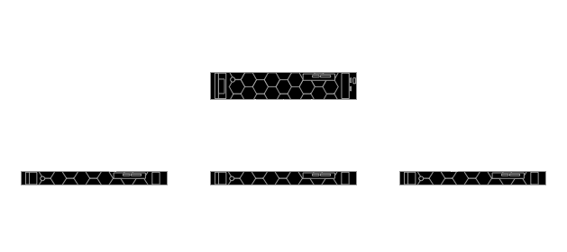

```{r setup, include=FALSE}
knitr::opts_chunk$set(echo = TRUE)
```

## Definitions
- **HPC** - High-performance Computing
- **Node** - A single computer in the cluster's network. Most HPC clusters have a *head node* and one or more *compute nodes*
- **Cluster** - A group of networked computers/nodes.
- **Job** - A single unit of computation on the cluster. A user will submit one or more *jobs*, which will be scheduled and executed on one of the *compute nodes* when resources are available.

## Introduction to HPC (High-Performance Computing)

An HPC cluster is a group of high-performance networked computers called *nodes*. 

A typical cluster will have multiple *compute nodes* which can perform heavy computation, as well as a *head node* which serves as the user's access point to the cluster, and may also be responsible for scheduling jobs among the *compute nodes*. 
The *compute nodes* in an cluster typically have compute resources (CPU Cores, RAM, Disk Space) which far exceed those of a typical laptop or desktop computer.

Because HPC clusters are intended to serve a group of people (i.e. A biostatistics department) rather than a single user, HPC clusters use the concept of a *jobs* to allow for multiple users to effectively share the cluster's resources.

When a user is ready to run something (an analysis, processing pipeline, etc) on the cluster, they will submit a new *job* to the cluster. The cluster will then schedule and run the job as soon as compute resources are available.


The example figure above shows an example cluster with three users. Each user connects to the Head Node to submit their jobs.

 User 1 has submitted two jobs, which were both scheduled to run on Compute Node 1. User 2 has submitted a single job, which is also running on Compute Node 2. User 3 has submitted a job which requires a large amount of compute resources (CPU cores, RAM, etc). This job runs on Compute Node 2 to provide the user with the resources they requested.

HPC clusters are useful for:
1. Performing analyses which take a long time to run (i.e. A large-scale analysis which takes hours to complete)
1. Performing analyses which are too resource-intensive (require too much RAM, Disk Space, etc) to run on a typical computer.

## CSPH Biostats HPC Cluster

The CSPH Biostats cluster consists of four nodes. The `csphbiostats.ucdenver.pvt` node serves as both a head node and one of the compute nodes (i.e. Submitted jobs may also run on this node), and the `cidalappc[1-3].ucdenver.pvt` nodes serve as compute nodes. 



The CIDA/Biostats server uses [SLURM](https://slurm.schedmd.com) system to manage job scheduling and resource management on the cluster. 

## Accessing the CSPH Biostats Cluster

To access the CSPH Biostats cluster, first submit a support ticket on the [SOM IS web page](https://medschool.cuanschutz.edu/informationservices) requesting:

1. Access to the 'CSPH/CIDA Biostats Cluster'.
2. (optional) A directory under `/biostats_share` (i.e. `/biostats_share/<your_username>`).

Once approved, an account will be created for you on the server.

To log in to the CSPH Biostats Cluster, you can use SSH from the command line or an SSH client of your choice. 


If you are connecting from the command line (like the above example), run:

```{shell}
ssh <your_username>@csphbiostats.ucdenver.pvt
```

where `<your_username>` is your CU system username (i.e Your username for UCDAccess, Outlook, etc)

On login, you will be prompted for a password which will be your CU system password (i.e. Your password for UCDAccess, Outlook, etc).

Once you've successfully logged in, you should see a prompt like the final line in the screenshot, showing that you are logged in to `csphbiostats.ucdenver.pvt`.

To make future logins more covenient, you can configure an SSH config profile and RSA keypair, which will enable password-less login. (See [SSH Key Authentication](#ssh-key-authentication))

## Uploading Data to the CSPH Biostats Cluster

To upload and download data from the cluster, it is most convenient to use SFTP. There are multiple ways to use SFTP, including through the command line using the `sftp` command (Mac/Unix-like systems only)

On Mac, the [Cyberduck](https://cyberduck.io) application is a free and intuitive GUI SFTP client. On Windows systems, [WinSCP](https://winscp.net/eng/index.php) is another popular choice.

The below screenshots show an example of connecting to `csphbiostats.ucdenver.pvt` using Cyberduck on Mac.

First, open Cyberduck and click the 'Open Connection' button on the top bar.


Next, ensure that the 'SFTP' option is selected in the dropdown, then input your SSH credentials.


If successful, you should see a file broswer interface showing your home directory on `csphbiostats.ucdenver.pvt`.

You can use the interface to navigate and download and existing files. You can also drag-and-drop files from your local machine to upload them to the cluster.


## Submitting Cluster Jobs

## Submitting a Batch Job


## Submitting an Interactive Job

## Other Useful SLURM Commands

## Running RStudio Server and JupyterLab

## SSH Key Authentication


