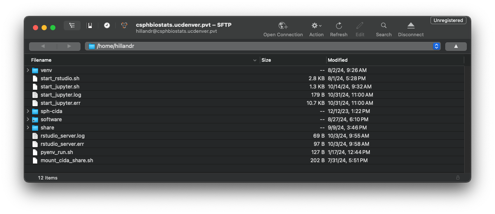

```{r setup, include=FALSE}
knitr::opts_chunk$set(echo = TRUE)
```

## Definitions
- <a name="def_hpc"></a>**HPC** - High-performance Computing
- <a name="def_node"></a>**Node** - A single computer in the cluster's network. Most HPC clusters have a *head node* and one or more *compute nodes*
- <a name="def_headnode"></a>**Head Node** - A node within the cluster which serves as the user's access/login point to the cluster. Depending on cluster configuration, the head node may also be responsible for scheduling and distributing jobs to the compute nodes.
- <a name="def_compnode"></a>**Compute Node** - A node within the cluster which is designated for running user-submitting jobs. Compute nodes usually offer large amounts of computational resources (CPU cores, RAM, etc).
- <a name="def_clust"></a>**Cluster** - A group of networked computers, usually running cluster-management software to coordinate resource sharing among multiple users.
- <a name="def_job"></a>**Job** - A computational task executed on the cluster. A submitted job will be scheduled and executed on one of the compute nodes.

## Introduction to HPC (High-Performance Computing)

An HPC cluster is a group of networked high-performance computers (*nodes*). 

A typical cluster will have multiple *compute nodes* which can perform heavy computation, as well as a *head node* which serves as the user's access point to the cluster, and may also be responsible for scheduling jobs among the *compute nodes*. 
The *compute nodes* in an cluster typically have compute resources (CPU Cores, RAM, Disk Space) which far exceed those of a typical laptop or desktop computer.

Because HPC clusters are intended to serve a group of people (i.e. A biostatistics department) rather than a single user, HPC clusters use the concept of [jobs](#def_job) to allow for multiple users to effectively share the cluster's resources.

When a user is ready to run something (an analysis, processing pipeline, etc) on the cluster, they will submit a new *job* to the cluster. The cluster will then schedule and run the job as soon as compute resources are available.

```{r, echo=FALSE, out.width="80%", fig.align="center"}
knitr::include_graphics("cluster_basic_diagram.png")
```

The example figure above shows an example cluster with three users. Each user connects to the Head Node to submit their jobs.

 User 1 has submitted two jobs, which are both running on Compute Node 1. User 2 has submitted a single job, which is also running on Compute Node 2. User 3 has submitted a job which requires a larger amount of compute resources (CPU cores, RAM, etc). This job runs on Compute Node 2 to provide the user with the resources they requested.

HPC clusters are useful for:

1. Performing analyses which take a long time to run (i.e. A large-scale analysis which takes hours to complete)
2. Performing analyses which are too resource-intensive (require too much RAM, Disk Space, etc) to run on a typical computer.

## CSPH Biostats HPC Cluster

The CSPH Biostats cluster consists of four nodes. The `csphbiostats.ucdenver.pvt` node serves as both a head node and one of the compute nodes (i.e. Submitted jobs may also run on this node), and the `cidalappc[1-3].ucdenver.pvt` nodes serve as compute nodes. 

```{r, echo=FALSE, out.width="100%", fig.align="center"}
knitr::include_graphics("Biostats_HPC_diagram.png")
```

The CIDA/Biostats server uses the [SLURM](https://slurm.schedmd.com) system to manage job scheduling and resource management on the cluster. 

## Accessing the CSPH Biostats Cluster

To access the CSPH Biostats cluster, first submit a support ticket on the [SOM IS web page](https://medschool.cuanschutz.edu/informationservices) requesting:

1. Access to the 'CSPH/CIDA Biostats Cluster'.
2. (optional) A directory under `/biostats_share` (i.e. `/biostats_share/<your_username>`).

Once approved, an account will be created for you on the server.

To log in to the CSPH Biostats Cluster, you can use SSH from the command line or an SSH client of your choice. 

```{r, echo=FALSE, out.width="80%", fig.align="center"}
knitr::include_graphics("biostats_hpc_ssh.png")
```

If you are connecting from the command line (like the above example), run:

```
ssh <your_username>@csphbiostats.ucdenver.pvt
```

where `<your_username>` is your CU system username (i.e Your username for UCDAccess, Outlook, etc)

On login, you will be prompted for a password which will be your CU system password (i.e. Your password for UCDAccess, Outlook, etc).

Once you've successfully logged in, you should see a prompt like the final line in the screenshot, showing that you are logged in to `csphbiostats.ucdenver.pvt`.

To make future logins more covenient, you can configure an SSH config profile and RSA keypair, which will enable password-less login. (See [SSH Key Authentication](#ssh-key-authentication))

## Submitting a Job on the CSPH Biostats Cluster

In the sections below, I will describe a few different ways of submitting a job on the cluster, along with their potential use cases.

### Using `sbatch`
The most common way of submitting a job on the cluster is to use the `sbatch` command.

To submit a job using `sbatch`, you should first create a batch script which will list the commands to be executed as part of your job. 

The below example shows a simple batch script `my_batch.sh` which executes a single R script. 

```
#!/bin/bash
#SBATCH --job_name=my_batch
#SBATCH --out=my_batch.log
#SBATCH --err=my_batch.err

Rscript my_analysis.R
```

The first line:

```#!/bin/bash```

 is required, and is used to determine how your script will be executed. In this case, the script will be executed using `bash`.

The next few lines will be parsed by SLURM to set parameters/options for your batch job. 

```
#SBATCH --job_name=my_batch
#SBATCH --output=my_batch.log
#SBATCH --error=my_batch.err
```

In order:

1. `--job-name` - Sets a name for your job.
2. `--output` - Sets the output log file for your job. Any log messsages or outputs from your script will be sent to this file.
3. `--error` - Sets the error log file for your job. Any log or error messages produced by your script will be sent to this file.

Any comment line containing `#SBATCH` before the first command in your script will be parsed by SLURM.

Although `#SBATCH` lines are not required, I recommend at least providing the `--output` and `--error` options, since otherwise your output and error streams will both be directed to the default file `slurm-<job_id>.out`

We can submit this job by running:

```
sbatch my_batch.sh
```

```{r, echo=FALSE, out.width="80%", fig.align="center"}
knitr::include_graphics("cluster_sbatch.png")
```

When we execute the `sbatch` command, SLURM will assign the job an ID and schedule the job to execute. In this case, our job is assigned ID `6179` (first arrow in the figure).

By using the `squeue` command, we can obtain the status of all jobs currently scheduled across the cluster (including those submitted by other users).

Using the assigned job ID, we can use the `JOBID` column to identify our job in the queue (second arrow in the figure). 

The `squeue` also provides some useful information about our job:

- The `ST` column tells us that our job is in the running (`R`) state.
- The `TIME` column tells us that our job has been running for 9 seconds.
- The `NODELIST(REASON)` column tells us that our job is executing on the `csphbiostats.ucdenver.pvt` node.


#### When to use `sbatch`
Using `sbatch` is most beneficial for long-running scripts or analyses. After the job has been submitted using `sbatch`, your job will execute on the cluster until completion. You can continue to work on the cluster (submitting other jobs, etc) or log out without affecting any of your running jobs. 

You can monitor the progress of your job using by checking your log (`--output`) and error (`--error`) output files to see any outputs/messages printed by your script. 

Additionally, you can use the `squeue` command to obtain other information about your job, including the current state (`ST`), the elapsed runtime (`TIME`), and location of your job (`NODELIST`).

### Using `srun`

Submitting a job using SLURM's `srun` command will schedule and run the job as soon as possible. When the job begins to run, you will see the output of the job in your terminal as it executes. 

Similar to running a script locally on the command line (i.e. `./my_script.sh`), you will not be able to execute other commands in your terminal window until the submitted job is complete. 

An example below shows execution of a simple shell script using `srun`.

The command:

```
srun --exclude=csphbiostats.ucdenver.pvt ./my_script.sh
```

will schedule a new job to run the script `./my_script.sh`. 

The `--exclude` flag tells SLURM to schedule the job on any node except the node(s) listed. In this case, we exclude the `csphbiostats.ucdenver.pvt` node to ensure our job runs on one of the `cidalappc[1-3].ucdenver.pvt` nodes (and the first line of the script output shows our job ran on `cidalappc01`).

```{r, echo=FALSE, out.width="80%", fig.align="center"}
knitr::include_graphics("cluster_srun.png")
```

#### Interactive Jobs
`srun` is also useful for running *interactive* jobs. An interactive job opens a terminal session on a compute node, allowing you to run commands and script interactively.

Interactive jobs are useful for running quick commands or scripts on a compute node.

The command:

```
srun --pty --exclude=csphbiostats.ucdenver.pvt /bin/bash -i
```

will schedule a new interactive job on a compute node. 

This command is similar to the previous `srun` command we used but has a few key differences:

1. The addition of the `--pty` flag tells SLURM that this is an interactive job.
2. The command `/bin/bash -i` will execute an interactive shell on the compute node.

After submitting the job, we see the prompt string has changed from:

```[hillandr@csphbiostats job_example]```

 to 

 ```[hillandr@cidalappc01 job_example]```.

This indicates that we are now running an interactive job on the compute node `cidalappc01`. 

At this point, we can execute any commands or scripts normally.

To end the interactive job, type `exit`.

```{r, echo=FALSE, out.width="80%", fig.align="center"}
knitr::include_graphics("interactive_job.png")
```

#### When to use `srun` 

`srun` is useful for running interactive jobs with fast-running commands/scripts, or for debugging issues with a larger script you will eventually submit using `sbatch`.

I don't reommend using `srun` for long-running jobs, as if you disconnect from the cluster while the `srun` command is still executing, the job may be cancelled.

## Uploading Data to the CSPH Biostats Cluster

To upload and download data from the cluster, it is most convenient to use SFTP. There are multiple ways to use SFTP, including through the command line using the `sftp` command (Mac/Unix-like systems only)

On Mac, the [Cyberduck](https://cyberduck.io) application is a free and intuitive GUI SFTP client. On Windows systems, [WinSCP](https://winscp.net/eng/index.php) is another popular choice.

The below screenshots show an example of connecting to `csphbiostats.ucdenver.pvt` using Cyberduck on Mac.

First, open Cyberduck and click the 'Open Connection' button on the top bar.

```{r, echo=FALSE, out.width="80%", fig.align="center"}
knitr::include_graphics("cyberduck_1.png")
```

Next, ensure that the 'SFTP' option is selected in the dropdown, then input your SSH credentials.

```{r, echo=FALSE, out.width="80%", fig.align="center"}
knitr::include_graphics("cyberduck_2.png")
```

If successful, you should see a file broswer interface showing your home directory on `csphbiostats.ucdenver.pvt`.

You can use the interface to navigate and download and existing files. You can also drag-and-drop files from your local machine to upload them to the cluster.

```{r, echo=FALSE, out.width="80%", fig.align="center"}

```

### Networked Storage

The CSPH Biostats cluster uses a shared filesystem for many important directories, including `/home` and `/biostats_share`. This means that any files (scripts, data, etc) you upload to one of these directories on `csphbiostats.ucdenver.pvt` will be accessible from any node in the cluster. 

Similarly, any output files generated from a job running on a compute node will also be accessible from `csphbiostats.ucdenver.pvt`, making it easy to download the results of a job.

### Other SLURM Resources

The SLURM system has an excellent [website](https://slurm.schedmd.com/documentation.html), with documentation for each command. I recommend reading the documentation for at least the [sbatch](https://slurm.schedmd.com/sbatch.html) command, as it contains infomration about many configuration options not listed in this document.

## Running RStudio Server and JupyterLab

TODO

## SSH Key Authentication

TODO

