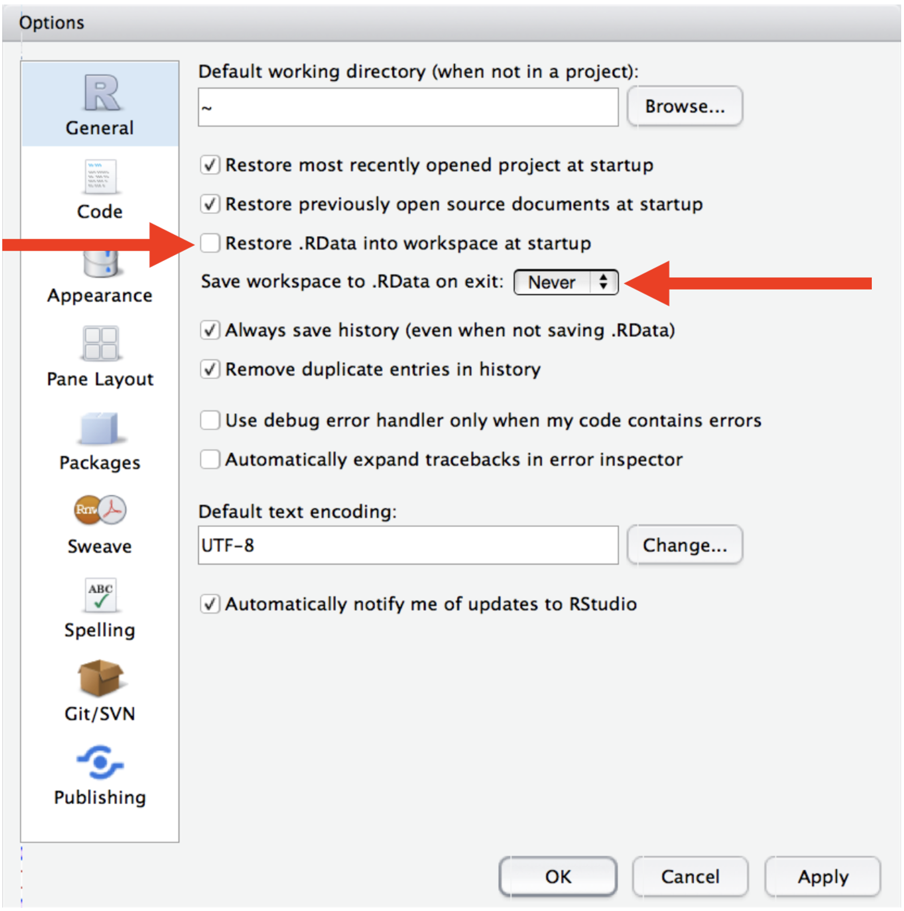

```{r setup, include=FALSE}
knitr::opts_chunk$set(echo = TRUE)
```

## Coding Guidelines and Best Practices

*Except for binary machine code, all computer code is intended to be read by humans.*

### Summary

Within a CIDA project, code should follow CIDA’s standard organizational structure and be consistently tracked in a Git repository on CIDA’s GitHub server. Strive to use best practices for coding conventions.

### CIDA Standards for Organization

#### File Organization

Files should be organized to fit within the general CIDA file structure.  Within the root location of a project should be found the folders:

* Admin – where any administrative files go (i.e., the SOW)
* Background – where any background documents go
* Code – where any code goes
* DataProcessed – where data goes after any manipulation by the statistician
* DataRaw – where any raw data goes from an investigator
* Dissemination – where any files go that have been sent to the investigator, in the state they were sent
* Reports – where any reports, figures, or other output goes

Within Code/* any code files should be labelled in a usable way and ordered, for example

*	00_prep.R
*	01_dataread.R
*	01a_dataread_auxilliary.R
*	02_dataclean.R
*	...

At the conclusion of a project any files labelled as such should be the last version used; and when used together or in sequence result in the final project results.

#### Experimental code

*	Any code in final scripts at project conclusion and archival should be able to be run in sequence to achieve the result
*	Any code that is not included in the result is ‘experimental’ and should be placed into a separate file, or commented out if left in the main scripts

### Suggestions for easier comprehension

#### Naming Conventions

Names should follow one of the following naming conventions consistently within a script (with the exception of pre-existing column titles from other databases), and be concise and meaningful.  Avoid naming objects the same or similar names to standard functions.

*	alllowercase – all lowercase letters
*	period.separated – words separated by periods
*	underscore_separated – words separated by underscores
*	camelCase – words denoted by capital letters

#### Functions

*	If you find yourself copying and pasting code frequently, you’d likely benefit from creating a function. Read the key ideas behind R functions [here](https://r4ds.had.co.nz/functions.html). 
*	Functions beyond trivial wrappers should start with a header that describes the function, its input(s) and output(s) and any other pertinent information about the function.  
*	User-created functions should be named distinctly from other common functions.  
*	Returns from functions should be done explicitly, and not rely on implicit returns.
*	Name your created functions as a descriptive verb and use nouns for objects. 

#### Commenting
*	The start of a script file should start with a header containing at least the title, the author, the date created, and the purpose of the script.
*	Sections of code should be denoted by headers of consistent formatting.
*	Any complex or involved code should be commented for what it is doing and why.
*	Any non-standard choices in analysis should be commented and the comment include a reference as to why this was done and when the decision made.
*	Comments are for the why, not the what.

### Best practices

This section describes best practices for R, R Markdown, and general coding. They are not meant to be “enforced”, but if followed, they will make your (and your CIDA collaborators’) lives easier later on.  

#### R Scripts (.R files)
*	Avoid using `attach()`, use `with()` instead or another alternative. 
*	Outside of function calls, use `<-`, not `=,` for assignment. 
*	Do not use right-hand assignment (e.g., don’t do this: `1 -> x`)
*	For non-ubiquitous R packages, avoid using `library()`, and to instead use the :: operator when calling functions from their specific libraries, e.g., `CIDAtools::pvalr`. 
*	Place spaces around all infix operators (`+`, `-`, `=`, `<-`) and after all commas (not before).
*	Use [RStudio’s Projects](https://r4ds.had.co.nz/workflow-projects.html#rstudio-projects) to avoid ever having to set your working directory in your R scripts. Or, use `setwd()` only once at the very top of your script. 
*	Use the pipe operator (`%>%`), for reasons described [here](https://r4ds.had.co.nz/pipes.html), but keep pipes under 10 steps. Break up large sequences with intermediate objects with meaningful names. 

#### R Markdown (.Rmd files)

*	Familiarize yourself with [R Markdown’s vast array of options and features](https://r4ds.had.co.nz/r-markdown.html#r-markdown).
*	Ensure each notebook has a descriptive title, an evocative filename, and a first paragraph that briefly describes the aims of the analysis.
*	Before you finish for the day, make sure you can knit the notebook (if you’re using caching, make sure to clear the caches). That will let you fix any problems while the code is still fresh in your mind. This is also a good time to push your new day’s code to GitHub (if you haven’t been doing so already). 
*	If you want your code to be reproducible in the long-run (i.e. so you can come back to run it next month or next year), you’ll need to track the versions of the packages that your code uses. For this purpose, include a chunk at the end of your notebook (in an appendix) that runs `sessionInfo()`. If you need to reproduce your report in its entirety and with the same versions of packages, you will then know which package and versions you need, and reinstall them `CRAN`. 

#### General best practices for programming

*	If you discover an error in a data file, do not modify it directly, but instead write code to correct the value. Explain (in comments) why you made the fix.
*	Use ISO8601 YYYY-MM-DD format for dates so that’s there no ambiguity. 
*	Keep code to 80 characters or less per line. Exceptions exist for hard-coded constants (such as path names or URLs) which cannot easily be wrapped or shortened.
*	Program files should always be ASCII text files. Program files should always be immediately source-able into R or SAS. If you cannot source your file directly into R (SAS), then the file format is not acceptable. Word processing programs like Microsoft Word do not save files as text files – do not save code as Word documents.
*	Use a monospace font to write or display code. Variable space fonts like Times New Roman can alter the apparent structure of a program (and its readability).
*	Consistently indent your code. Comments should be indented to the same level of indentation of the code to which the comment pertains. Comments can also appear at the end of a code line if space permits.
*	For all objects/functions in your code, strive for names that are concise and meaningful. Similarly, ensure the script names are also [concise]{.underline} and [meaningful]{.underline}. 

### Workflow best practices

Quote from R for Data Science: 

> One day you will need to quit R, go do something else and return to your analysis the next day. One day you will be working on multiple analyses simultaneously that all use R and you want to keep them separate. One day you will need to bring data from the outside world into R and send numerical results and figures from R back out into the world. To handle these real life situations, you need to make two decisions: 1) What about your analysis is “real”, i.e. what will you save as your lasting record of what happened? 2) Where does your analysis “live”?

Initially, you may consider your analysis to live in your R environment (e.g. the objects listed in the environment pane). However, it’s much easier to recreate this environment from an R script than it is to recreate an R script from the environment! Your analysis therefore lives in your code. So, if you haven’t already, you should instruct RStudio to never preserve your workspace between sessions to foster this attitude and to make your life easier in the long-term. 

```{r, echo=FALSE, out.width="75%", out.height="75%", fig.align='center'}

```

After changing this, you will notice when you restart RStudio that it will not remember the results of the code you ran last time, because remember – your analysis lives in your code.

If you are working within an Rstudio Project, you will not usually have to worry about absolute vs relative file paths (as files will automatically be saved/loaded from the location of the main project (or its subdirectories). However, if you are knitting a R Markdown file in the `Reports/*` subdirectory and/or loading files elsewhere, you may consider wrapping file paths inside the `here()` function (from the [here package](https://here.r-lib.org)) to ensure all file paths work as anticipated. If your data live on an external server, you may need to point to that server when reading in data (this would be an absolute file path) rather than saving in `DataRaw/*`. If this is the case, please indicate in the project readme file (or that in `DataRaw/*` the information on where the data exists (and a contact email address for the owners/maintainers of this server).

### Useful reporting functions: The CIDAtools R Package 
*	The CIDAtools R package, available [here](https://github.com/CIDA-CSPH/CIDAtools), has a suite of useful functions that makes producing CIDA reports easier. The readme of this package also has information on reporting templates/outlines. 
*	Please see the package documentation for more information, and contact the [committee chair](mailto:ryan.a.peterson@cuanschutz.edu) with suggestions for making this package more useful. 

### Where to store your code

*	All project files + code, with the exception of data, can be stored anywhere (locally, on OneDrive, etc). 
*	Project code must be tracked in a Git repository and regularly pushed to GitHub. (see below) 
*	Project data (stored in `DataRaw/` or `DataProcessed/`) should be backed up to the CIDA drive at least weekly; see this committee’s data storage guidelines and `CIDAtools::BackupProject()`. 

### Tracking code/files in Git and GitHub

*	Your code and files should be committed and pushed to GitHub regularly (daily recommended).
*	**Data should not be tracked in Git**. Ensure your repository has a text file titled `.gitignore` at its main level that tells Git software not to track any data related files or file types. See below for a sample .gitignore file that ignores any CSV, XLSX files, as well as any files stored in DataProcessed or DataRaw subdirectories.
*	Contact [Ryan Peterson](mailto:ryan.a.peterson@cuanschutz.edu) or [SOM IT](mailto:sph@medschool.zendesk.com) with issues related to GitHub, or SOM IT. 

### Useful Links

*	[R for Data Science](https://r4ds.had.co.nz)
*	[Google style guide](https://google.github.io/styleguide/Rguide.html)

Sample `.gitignore` file, stored at the project-level directory (the top level of your git repository):

```{r, echo=FALSE, out.width="50%", out.height="50%", fig.align='center'}
knitr::include_graphics("coding_2.png")
```


  