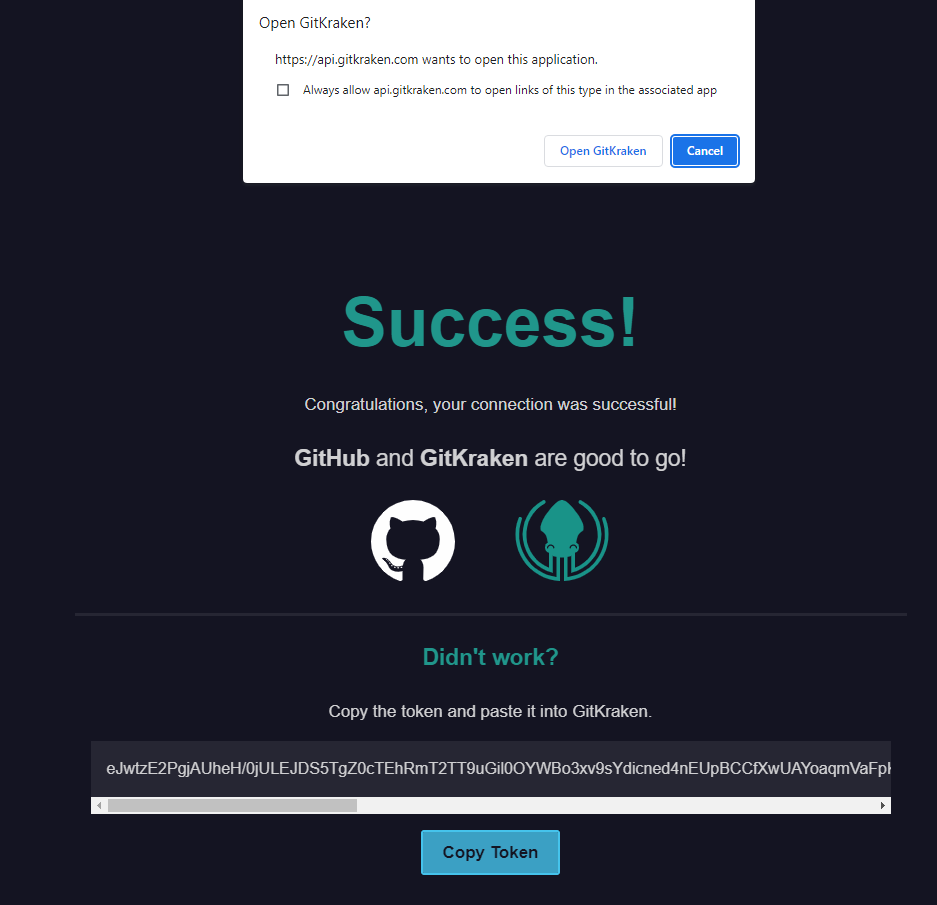
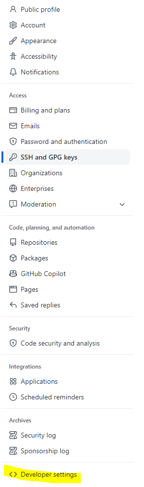
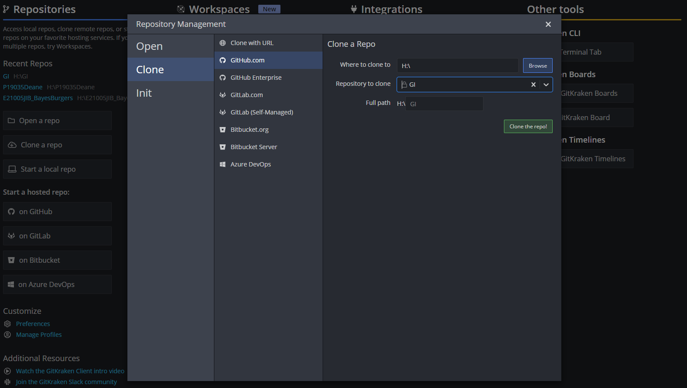

```{r, echo=FALSE, out.width='70%', fig.show='hold'}

```

---

```{r setup, include=FALSE}
library(CIDAtools)
```

# Introduction

## What is Git?

According to Git's website, "Git is a free and open source distributed version 
control system." So what does that mean? Let's break it down. First, Similarly to R, 
Git is available to anyone with a computer and access to the internet free of 
charge. Anyone can install and use it, and anyone can contribute to the project
(if they have the technical know-how). 

As for the second half, a version control system (VCS) is a tool that enables
teams as small as a single person or as large as a multinational corporation to
track changes in code over time and to integrate changes made by a 
decentralized team of developers.

For our purposes, Git enables us to create reproducible analysis code bases,
where the full history of the analysis is available to ourselves and those which
we choose to share it with.

## What is GitHub?

## Command Line Basics

In order to use Git from the command line (Terminal or Git Bash), a certain
level of basic commands will be needed to navigate the files on your computer. 
Below is a list of commands that will help you navigate your directories and
accomplish basic tasks using the command line.

- `ls` - List subdirectories and files in current directory
- `pwd` - Print working directory
- `cd` - Change directory (i.e., navigate to a different folder)
  - `cd MyFolder` - Move to the folder `MyFolder` located in current working
  directory
  - `cd Path/To/MyFolder` - Move to the folder `MyFolder` located at 
  `Path/To/` inside the current working directory
  - `cd ..` - Move to parent directory (i.e. one folder back)
  - `cd /` - Move to root directory
  - `cd ~` - Move to home directory
- `mkdir` - Make directory
- `rm <filename>` - Remove file

## Notes

### Terminal / Git Bash

The instructions which follow attempt to be applicable to both MacOS and Windows
platforms. However, some key differences do exist between the two
operating systems. In most of these situations we have created separate 
instructions for Windows and MacOS. However, for sections where MacOS and
Windows are functionally the same, only a single section is provided. In these
sections, some language used may reference Terminal, and in those cases you
should substitute Git Bash if you are using Windows operating system.

### Main vs Master

Historically, the default branch in a new Git repository was named `master`. 
However, in 2020 a push to remove unnecessary references to slavery led 
GitHub and other companies to change the default branch name to `main`. The
instructions which follow will assume the default branch name is `main` and
will show you how to setup your local Git configuration to default to `main`.

However, due to the relative recency of this change, you may encounter 
repositories that have `master` as the primary branch. In such situations, all
the instructions which follow will still be applicable, but you will need to
substitute `main` for `master`.

# Getting Started

## Installing Git

### MacOS

Open Terminal and run the command `git --version`. If you don't have Git
installed already, you will be prompted to install. Follow the 
instructions provided in the Terminal or pop-up window to install Git.

### Windows

Git and Git Bash come included as part of the 
[Git For Windows](https://gitforwindows.org/) package. 
Download and install Git For Windows like other Windows applications. Once 
downloaded find the included `.exe` file and open to execute Git Bash.

## Creating GitHub Account

Go to <https://github.com/> and click `Sign Up` in the upper right hand corner.
Follow the instructions to create an account, choosing an account name that is
easily identifiable as belonging to you (i.e. "firstname-lastname" or something
similar).

__NOTE:__ If you already have a personal GitHub account, you may continue to use
it for your work at CIDA __if__ your account name is easily identifiable as 
belonging to you (i.e. if you have an account name like "firstname-lastname" or 
something similar).

## Configure Git

To associate your local Git configuration with your name and Email, run the 
commands below in Terminal or Git Bash. Here, `your_email@cuanschutz.edu` should
be substituted with
the email associated with your GitHub account. If you are using a preexisting
personal GitHub account, this may or may not end with `cuanschutz.edu`. 

```{bash, eval=FALSE, echo=TRUE}
git config --global user.name "Firstname Lastname"
git config --global user.email "your_email@cuanschutz.edu"
```

Additionally, your local Git should be configured to make `main` the default
branch name. To do so, run the following command in Terminal/GitBash:

```{bash, eval=FALSE, echo=TRUE}
git config --global -add init.defaultBranch main
```

## Requesting CIDA GitHub Access

Following account creation, send an email containing your GitHub username to 
`ryan <dot> peterson <at> cuanschutz <dot> edu` and 
`max <dot> mcgrath <at> cuanschutz <dot> edu` to request access to CIDA's GitHub
organization (please send email from your cuanschutz.edu email address).

## Setting Up SSH

The below instructions are up-to-date as of 10/05/22. Newer instructions along 
with additional troubleshooting may
be available from [GitHub](https://docs.github.com/en/authentication/connecting-to-github-with-ssh)

### MacOS

1. Check for Existing SSH Keys
    a. Open Terminal
    b. Enter `ls -al ~/.ssh` to see if existing SSH keys are present by looking
    for the following filenames:
        - id_rsa.pub
        - id_ecdsa.pub
        - id_ed25519
    c. If you see any of these files present, proceed to Step 3. Otherwise
    continue with Step 2.
2. Generate a new SSH key
   a. Open Terminal
   b. Enter `ssh-keygen -t ed25519 -C "your_email@example.com"` substituting in
   the email address associated with your GitHub account
   c. When you're prompted to "Enter a file in which to save the key," press 
   Enter. This accepts the default file location.
   d. At the prompt, type a secure passphrase
   e. Start the ssh-agent in the background by running `eval "$(ssh-agent -s)"`
   f. Open the configuration file with `open ~/.ssh/config`
      - If the file doesn't exist create it with `touch ~/.ssh/config` then use
      the above command to open it
   g. Edit `~/.ssh/config` to contain the following lines:
   
```{bash, eval=FALSE, echo=TRUE, indent = "       "}
Host *
  AddKeysToAgent yes
  UseKeychain yes
  IdentityFile ~/.ssh/id_ed25519
```
   h. Add your SSH private key to the ssh-agent and store your password in the 
   keychain by running `ssh-add --apple-use-keychain ~/.ssh/id_ed25519`
3. Add SSH key to GitHub account
    a. Copy the SSH public key to your clipboard with 
    `pbcopy < ~/.ssh/id_ed25519.pub`
    b. Open GitHub in a web browser, log in
    c. Go the the upper right hand corner, click your profile photo, and
    select __Settings__
    d. Select __SSH and GPG keys__ in the menu on the left
    e. Click green __New SSH key__ button
    f. Enter a title for the SSH key in the __Title__ field (use descriptive 
    title like "CIDA MacBook Pro")
    g. Select __Key type__ as "Authentication Key"
    h. Paste your key into the __Key__ field
    i. Click __Add SSH key__
4. Verify connection
    a. Test access to GitHub SSH with `ssh -T git@github.com`
    b. If you see the following message, verify that the fingerprint you see
    matches GitHub's public key fingerprint
    ([link](https://docs.github.com/en/authentication/keeping-your-account-and-data-secure/githubs-ssh-key-fingerprints)). 
    If it does, type `Yes`
```{bash, eval=FALSE, echo=TRUE, indent = "           "}
> The authenticity of host 'github.com (IP ADDRESS)' cant be established.
> RSA key fingerprint is SHA256:nThbg6kXUpJWGl7E1IGOCspRomTxdCARLviKw6E5SY8.
> Are you sure you want to continue connecting (yes/no)?
```
    c. Verify that the resulting message contains your username. If you receive 
    a "permission denied" message, see [Error: Permission denied (publickey)](https://docs.github.com/en/authentication/troubleshooting-ssh/error-permission-denied-publickey)


### Windows

1. In Git Bash, type `ssh-keygen`
2. Press enter to save the SSH key to the default location
3. Enter a password to password protect your SSH key or leave blank and hit 
`Enter` to proceed without a password
4. You will recieve a message saying your public key has been saved in 
`c/Users/username/.ssh/id_rsa.pub`, type `cat c/Users/username/.ssh/id_rsa.pub`
to output the key
5. Copy and paste the key
6. Add SSH key to GitHub account
    a. Open GitHub in a web browser, log in
    b. Go the the upper right hand corner, click your profile photo, and
    select __Settings__
    c. Select __SSH and GPG keys__ in the menu on the left
    d. Click green __New SSH key__ button
    e. Enter a title for the SSH key in the __Title__ field (use descriptive 
    title like "CIDA MacBook Pro")
    f. Select __Key type__ as "Authentication Key"
    g. Paste your key into the __Key__ field
    h. Click __Add SSH key__


## Setting up SSO

Copy/distill instructions here: 
<https://docs.github.com/en/enterprise-cloud@latest/authentication/authenticating-with-saml-single-sign-on/about-authentication-with-saml-single-sign-on>

1. After being granted access to the CIDA-CSPH GitHub organization and setting 
up SSH, go to <https://github.com>, log in
2. In the upper-right corner of any page, click your profile photo, then click
__Settings__
3. Select __SSH and GPG keys__ in the menu on the left
4. To the right of the SSH key you'd like to authorize, click __Configure SSO__.
If you don't see __Configure SSO__, ensure that you have authenticated at least
once with the CIDA-CSPH organization by visiting 
<https://github.com/orgs/CIDA-CSPH/>, accessing a non-public repository, and
signing in with your CU login
5. You will see __CIDA-CSPH__ listed. Click __Authorize__ to the right.

## Creating New Project

1. Create project folder on your local computer by calling 
`CIDAtools::create_project()` in `R`
2. Initialize git repository by navigating to folder (`cd Path/To/Folder`) then
using the command `git init`
3. Stage file changes `git add . `
4. Create initial commit with `git commit -m "Initial commit"`
5. Create empty repository in CIDA-CSPH GitHub organization
    a. In a web browser, navigate to <https://github.com/orgs/CIDA-CSPH/repositories>
    b. Sign in using your CU login
    c. Click the green `New repository` button
    d. Enter the name of your repository
    e. Do __not__ add a template, README, .gitignore, or license file
    f. Click `Create repository`
6. Add remote to local repository with 
`git remote -v git@github.com:CIDA-CSPH/<your-repository>.git` (this SSH link
can be copied from the empty GitHub remote repository you've just created).
7. Push work to GitHub with `git push origin main`

## Cloning Existing Project

1. Navigate to GitHub remote repository
2. Click green "Code &or;" button
3. Click "SSH" then copy link
4. Clone repository with `git clone git@github.com:CIDA-CSPH/<your-repository>.git`

# Regular Workflow

1. Add and commit changes
```{bash, eval=FALSE, echo=TRUE, indent="   "}
cd Path/To/Directory
git add .
git commit -m "My commit message"
```
2. Fetch and merge any changes (see Handling Merge Conflicts below)
```{bash, eval=FALSE, echo=TRUE, indent="   "}
git fetch origin main
git merge origin/main
## Fix any merge conflicts
git commit -m "Brief description of changes (<=50 characters)"
```
3. Push all new commits
```{bash, eval=FALSE, echo=TRUE, indent="   "}
git push origin main
```

## Handling Merge conflicts

In the case that another user has modified and committed changes to a file that
you have modified in one of your recent commits, when you run `git pull` you 
may be notified that you have a merge conflict and need to resolve those
conflicts before you can push your changes to GitHub. To do so:

1. After running `git merge origin/main` and being notified that you have
merge conflicts, run `git status` to see which files have conflicts (they
will be listed with `both modified: ` in front of them)
    a. Note: On newer version of Git you may receive an error saying "You have
    divergent branches and need to specify how to reconcile them"
    b. In this case, you can add an indicator to pull without rebasing with
    `git merge --no-rebase origin/main`
2. Open those files in a text editor (RStudio, Vim, textEdit, Notepad++, etc.)
3. Here, you will see some sections of code with:

```{r, eval=FALSE, echo=TRUE, indent="   "}
<<<<<<< HEAD
# Version 1 of Code
=======
# Version 2 of Code
>>>>>>> commit_hash
```

4. Here, the section of code between `<<<<<<< HEAD` and `=======` is the local
version of the code, while the code between `=======` and `>>>>>>> commit_hash`
is the version of the code pulled from the remote (i.e., GitHub)
5. To fix the merge conflict, simply select which version of the code you want
to keep and delete the other version along with 
`<<<<<<< HEAD` and `=======` and `>>>>>>> commit_hash`. Note that you may also
need to mix and match between the two sections of code, but always delete the 
conflict markers.
6. Save your changes
7. Return to Terminal/Git Bash and add commit changes
```{bash, eval=FALSE, echo=TRUE, indent="   "}
git add .
git commit
```

# Additional Git Topics

## Branching

## Stashing changes

## Helpful Git Commands

# FAQ

Do we use GitHub? Or GitLab? Didn’t we just switch to GitHub? 

 - Either are currently viable options. We are currently transitioning from GitLab to GitHub, so if you are picking this up for the first time, I suggest using GitHub (and will call both “GH” from here on for simplicity). 

Where does my main analysis code "live"? When I'm committing and pushing to GitHub/Lab am I just making backups of my work that has its "home" on the P: drive? Or should the code "live" on the cloud in GitHub/GitLab, and every time I want to work with it, I should pull it down? 

- Your code will live on GH. Repos from GH can be cloned to wherever you want; locally, the P drive, etc. So when you need to run your code, your machine can read it from a local or network location. It’s best practice to pull from GH before you need to run anything for a project in case someone’s changed (if nothing has changed it will say “You repo is up to date”). 

Should I even then have a version of my code on the P: drive at all?  

- It’s up to you 

If I do, and I pull from GitHub/Lab, am I replacing the code on the P: drive?  

- Yes, but only if something’s changed on the GitHub server. You can also easily “checkout” earlier versions of the repository from previous points in time, so the older code is never lost. 

One advantage that people talk about a lot for using Git is that it can "merge" files from multiple people. How does this actually work?. What’s to prevent person A from pulling the syntax and making edits, person B pulling the syntax and making edits, and then both people pushing up to a Git server? Wouldn't there then be 2 versions of the file, neither of them fully correct? How is this an upgrade from not having Git?

- Git will force the person who pushes second to fix any merge issues in the code before pushing back to GitHub in this case. There are also more tools available such as branching if this issue comes up often for a particular project. 

I don't really use that much version control now anyways, ad-hoc or otherwise. Is this bad?  Have I just not been exposed to projects that change enough to merit it?

- CIDA requires code be tracked in Git and GitHub. Your future self will thank you.  

Often in my code I include additional “justification” code that’s commented out. For example, if I merge two datasets on ID, I also check the dimensions of the new merged dataset to make sure it is what I expected. Or, if I write a function, I also hard-code a version of the function to make sure the function actually does what it’s supposed to. These examples are a bit trivial, but I think they illustrate well the sort of “double-checking” that I sometimes include code for. Is this the sort of thing you think is valuable to include in code as a comment? Or does that bother some people, and should it be taken out of the syntax after the double-check has been completed?

- I think what you are referring to is “unit testing”, which is in fact good practice. I would put all new functions you create in a separate “helper-functions.R” file which can be scripted from your Rmd, and you can also have your (self-contained) unit tests there as well. 

Isn't there a CIDA element to the GH platform that we need to use, that is more "secure" or something? Or are we only supposed to use our personal GH accounts for all our work? 

- CIDA has a GitHub "organization" that is part of the CU GitHub Enterprise account. Membership to this organization can be merged with your personal GitHub account or a new GitHub account. All university- (CIDA-) related repos should live under this umbrella. The main page is https://github.com/CIDA-CSPH; you will need an account invitation; please contact a member of the Research Tools committee for an invitation.

# Git Kraken (Legacy)

This section will walk through how to set up GitKraken to interface with the 
CIDA GitHub, allowing you to easily push/pull projects between your working 
directory and GitHub. 

First, you will have to download GitKraken at 
<https://www.gitkraken.com/download>. Once installed, you will sign in with the 
GitHub account associated with the CIDA GitHub. This will take you to the SSO 
associated with the CIDA GitHub, which you will then authorize and sign onto.

```{r, echo=FALSE, out.width="100%", out.height="100%"}


```

Once you have logged into GitKraken with you GitHub account, you will need to 
connect it to GitHub. The default GitKraken screen has a panel called 
"Integrations": click on GitHub. From here, there are two possibilities: if you 
click on "Connect to GitHub" it may take you to the SSO again and you can log in
that way (slightly repetitive). Or, if prompted to use the OAuth or Personal 
Access token, you can do the following: go to your "Settings" tab on GitHub, 
click on "Developer Settings", and then click on "Personal access tokens" to 
generate a token for 90 days, making sure to select "repo" (along with other 
scopes as needed).

```{r, echo=FALSE, out.width="100%", out.height="100%"}
knitr::include_graphics("figure1A.PNG")
knitr::include_graphics("figure1B.PNG")
knitr::include_graphics("figure1C.PNG")
knitr::include_graphics("figure2A.PNG")


```

Ideally, you should be able to automatically connect to GitHub without 
generating a personal access token, but GitKraken is moderately cursed.

Once you have successfully connected to GitHub, you will then need to generate 
an SSH key and add to GitHub. To do this, simply click the "Generate SSH key 
and add to GitHub" button (optionally adding a title to the SSH key if you 
wish). If this step is successful, you will receive a notification within 
GitKraken on the lower left, and your screen will now display the SSH key 
within GitKraken and under the Settings -> SSH and GPG keys tab on your GitHub:

```{r, echo=FALSE, out.width="100%", out.height="100%"}


knitr::include_graphics("figure3C.PNG")
```

Congratulations, you should be successfully linked to the CIDA GitHub! 

From here, you can open, clone, and initiate repositories from the CIDA Github 
using the, you guessed it, Open a repo, Clone a repo, and Start a local repo 
options on the home screen:

```{r, echo=FALSE, out.width="100%", out.height="100%"}

```

If you are going to clone a repo, just make sure you are on the GitHub.com 
section, and that you select the CIDA repository to clone, as well as where you 
would like to clone it to (H: or P: drives, or elsewhere). 

```{r, echo=FALSE, out.width="100%", out.height="100%"}

```

First, however, you will need to generate another SSH key on GitKraken to add 
to your GitHub (at least this is the only way that I can figure). Go to 
Preferences -> SSH and then generate a new Private/Public Key, or copy the SSH 
Public Key if you already have one:

```{r, echo=FALSE, out.width="100%", out.height="100%"}
knitr::include_graphics("figure4C.PNG")
```

Then return to your GitHub account, and click on SSH and GPG keys under the 
settings, click Add new key, and then copy the SSH key into the Key box. You 
will then need to Authorize it with the SSO. After that, you should be able to 
clone, open, and initialize your repos!

```{r, echo=FALSE, out.width="100%", out.height="100%"}
knitr::include_graphics("figure4D.PNG")
```

Once you have cloned a repo, you can open it to push/pull any changes. This is 
done pretty simply via the push or pull commands on the top after opening the 
repo. 

```{r, echo=FALSE, out.width="100%", out.height="100%"}

```

For more details on how to manage pull, push, branching, and other features, 
visit https://help.gitkraken.com/gitkraken-client/github-gitkraken-client/

---

```{r, echo=FALSE, out.width='70%', fig.show='hold'}

```
